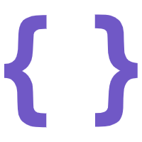
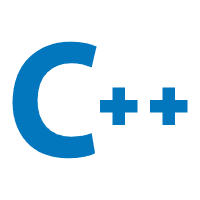

### **Hi there wuxie👋**

**平平无奇小全栈🤡**

**牢记前后端分离，人不分离 🥴**

- 📫 我的邮箱: [15182852522@163.com ](mailto:15182852522@163.com)
- 📝 我的博客: [思无邪-个人编程学习 (zqywuku.top)](https://blog.zqywuku.top/)(域名已过期)
- #### 开源项目
  - **志同道合(伙伴匹配系统)** 在线访问地址： [志同道合-伙伴匹配系统](https://zqywuku.top)(域名已过期)
      - PC端编写中
  - **云Api免费开放平台(请见仓库)**
  - **YunGo(基于golang的一站式框架 搁置)**
      - Web框架(完成,后续优化)
      - ORM框架(编写中)
      - 缓存
      - 微服务框架
      - 代码地址 LearnNote(code分支) [zqywuxie/LearnNote at code (github.com)](https://github.com/zqywuxie/LearnNote/tree/code)

### 前端技术

<code></code>
<code></code>
<code></code>
<code></code>
<code></code>
<code></code>
<code></code>
<code></code>

### 后端技术

<code></code>
<code></code>
<code></code>
<code></code>
<code></code>
<code></code>
<code></code>
<code></code>
<code></code>

### 开发工具
<code></code>
<code></code>
<code></code>
<code></code>

---

